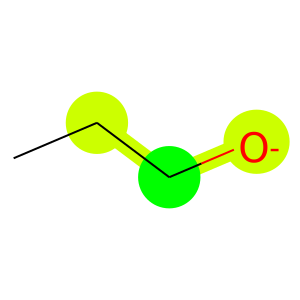

```python
import tensorflow as tf
import tensorflow.keras.backend as K
from rdkit import Chem
from mol2vec.features import mol2alt_sentence
from mol2vec.helpers import depict_identifier

from ImRRNet.model.build_model import ImRRNet_model
from ImRRNet.util.mol2vec_embedding import mol2vec_preprocessing
from ImRRNet.util import inverse_minmaxnorm
```

## Check substructures

#### makes sentence-like form


```python
with open("data/nucleophile_example.smi", 'r') as f:
    nuc_smi = f.readline()

nuc_mol = Chem.MolFromSmiles(nuc_smi)
print(mol2alt_sentence(nuc_mol,radius = 1))
```

    ['2246728737', '3542456614', '2245384272', '1173125914', '2245384272', '3789508882', '864942795', '1519496099']


#### visualize substructures
##### deeper green denotes center of substructure and lighter one denotes near neigbor


```python
depict_identifier(nuc_mol, mol2alt_sentence(nuc_mol,radius = 1)[5],1,)
```


    

    


## Load and preprocess data


```python
#### data load ####
with open("data/nucleophile_example.cp", 'r') as f:
    nuc_cp = f.readlines()
with open("data/electrophile_example.cp", 'r') as f:
    elec_cp = f.readlines()
#### preprocess data ####
maxlen = 117
mol2vec_preprocess = mol2vec_preprocessing("example/mol2vecmodel_300dim.pkl")
nuc = mol2vec_preprocess.convert_corpus_to_index(nuc_cp, maxlen = maxlen)
elec = mol2vec_preprocess.convert_corpus_to_index(elec_cp, maxlen = maxlen)
embedding_matrix = mol2vec_preprocess.mol2vec_embedding_matrix
```

## Build model and load weights
#### we provide weights of model with initial model architecture


```python
#build model and load weights
batch_size = 10
dropout_rate = 0.0
num_heads = 10
dim = 300
dff = [400,200]

K.clear_session()
model = ImRRNet_model(embedding_matrix = embedding_matrix,
                        num_heads = num_heads, 
                        dropout_rate = dropout_rate,
                        maxlen = maxlen,
                        dim = dim,
                        dff = dff,
                        kernel_regularizer = None)
model.load_weights("./ImRRNet_bestmodel_weights/weights")
```


    <tensorflow.python.training.tracking.util.CheckpointLoadStatus at 0x7f7a2c09e4e0>


## prepare data pipeline


```python
#### data pipeline ####
def generator_test():
    for s1, s2 in zip(nuc, elec):
        yield {"input_1":s1, "input_2":s2}
types = ({"input_1":tf.int32, "input_2":tf.int32})
shapes = ({"input_1":(maxlen),"input_2":(maxlen)})   
test_dataset = tf.data.Dataset.from_generator(generator_test,
                                            output_types = types,
                                            output_shapes = shapes)
test_dataset = test_dataset.batch(batch_size=batch_size)
```

## run model
#### because model was trained with minmax normalized data, inverse minmaxnorm operation is conducted


```python
prediction = model.predict(test_dataset)
print(inverse_minmaxnorm(prediction))
```

    [[0.17863846]]

